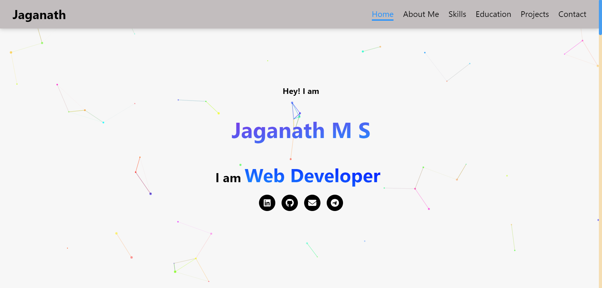

# Portfolio
Welcome to my online portfolio, where I present a collection of projects, highlight my skills, and share my experiences. This platform serves as a comprehensive showcase of my journey in the field of web development.

## Features
- A curated selection of my recent web development projects.
- A detailed breakdown of my skills and technologies.
- Insights into my professional experiences and achievements.

## Tech Stack
- React JS
- HTML5, CSS3 (Styled Component)
- Library Used:
    - Styled Component
    - Email JS
    - Framer Motion
    - Vanilla Tilt
    - JS Particles

## Key Features
- **Project Showcase:** Explore a variety of projects, each demonstrating unique skills and technologies.
- **Skills Highlight:** An in-depth breakdown of my proficiency in various web technologies.
- **Experience:** Learn about my professional journey, internships, and contributions.

## Get Started
1. Clone this repository: `git clone https://github.com/Jaganath-MSJ/React-Portfolio.git`
2. Navigate to the project directory: `cd React-Portfolio`
3. Install dependencies: `npm install`
4. Start frontend: `npm start`
5. Open the app in your browser: `http://localhost:3000`

## Demo:
For a live demonstration, you can visit [Demo Link](http://jaganath-portfolio.netlify.app).

## Contact:
Feel free to reach out to me via email at [jagan.msjc@gmail.com](mailto:jagan.msjc@gmail.com) or connect on [LinkedIn](https://www.linkedin.com/in/jaganathms).

## Thanks To
[Netlify](https://www.netlify.com)
