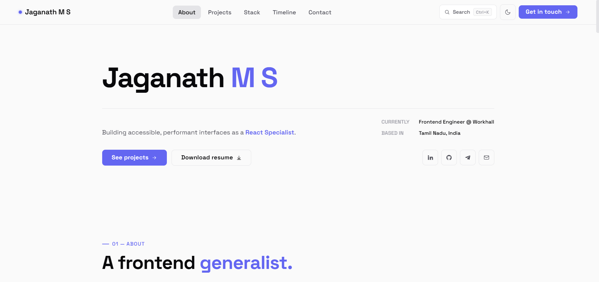

# Jaganath M S — Portfolio

My personal portfolio website — a single-page showcase of my projects, skills, and experience as a frontend engineer. Built as a fast, accessible, dark-first single-page app.

🔗 **Live:** [jaganath-portfolio.netlify.app](https://jaganath-portfolio.netlify.app)

## About

I'm Jaganath, an Electrical & Electronics Engineering graduate turned web developer, currently shipping React + TypeScript products at Workhall. I build accessible, performant interfaces and publish small open-source utilities on the side.

## Tech Stack

- **React 19 + TypeScript**
- **Vite** — build tool & dev server
- **React Router v7** — routing
- **CSS Modules + design tokens** — no CSS framework, no CSS-in-JS
- **mailto** — contact form opens the visitor's mail client
- **Netlify** — hosting

## Connect

- 📧 Email — [jagan.msjc@gmail.com](mailto:jagan.msjc@gmail.com)
- 💼 LinkedIn — [linkedin.com/in/jaganathms](https://www.linkedin.com/in/jaganathms)
- 🐙 GitHub — [github.com/Jaganath-MSJ](https://github.com/Jaganath-MSJ)
